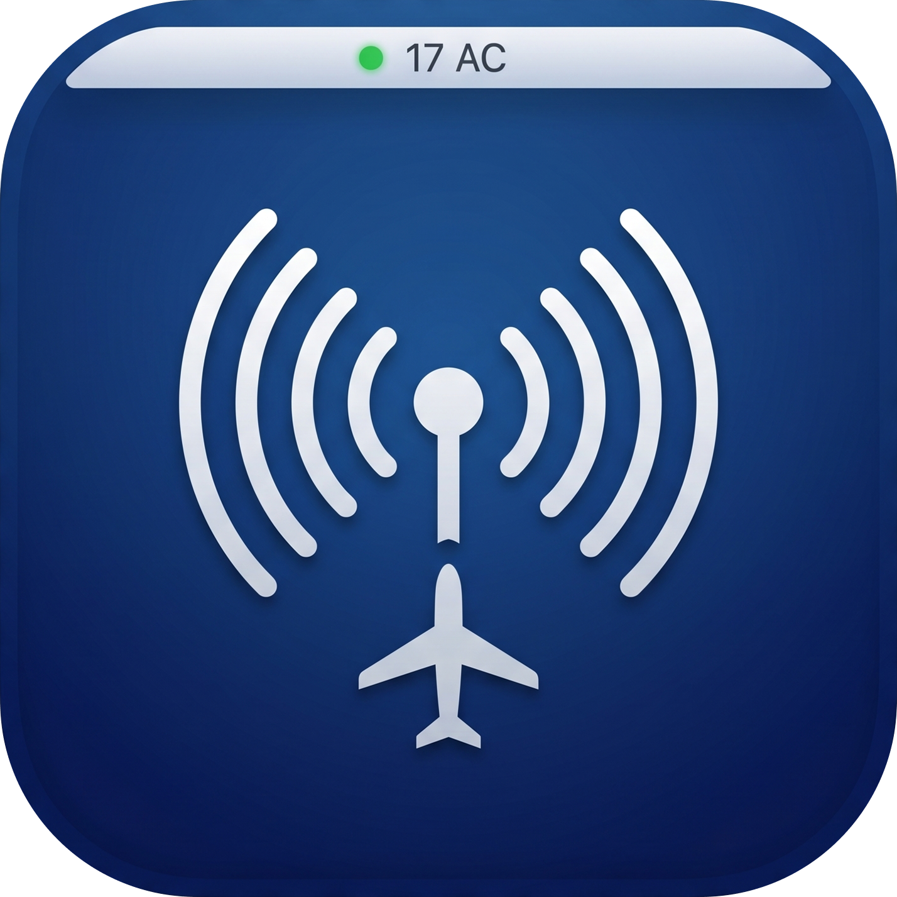
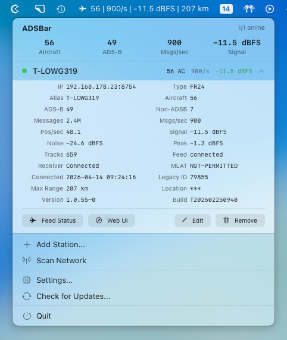
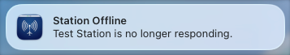
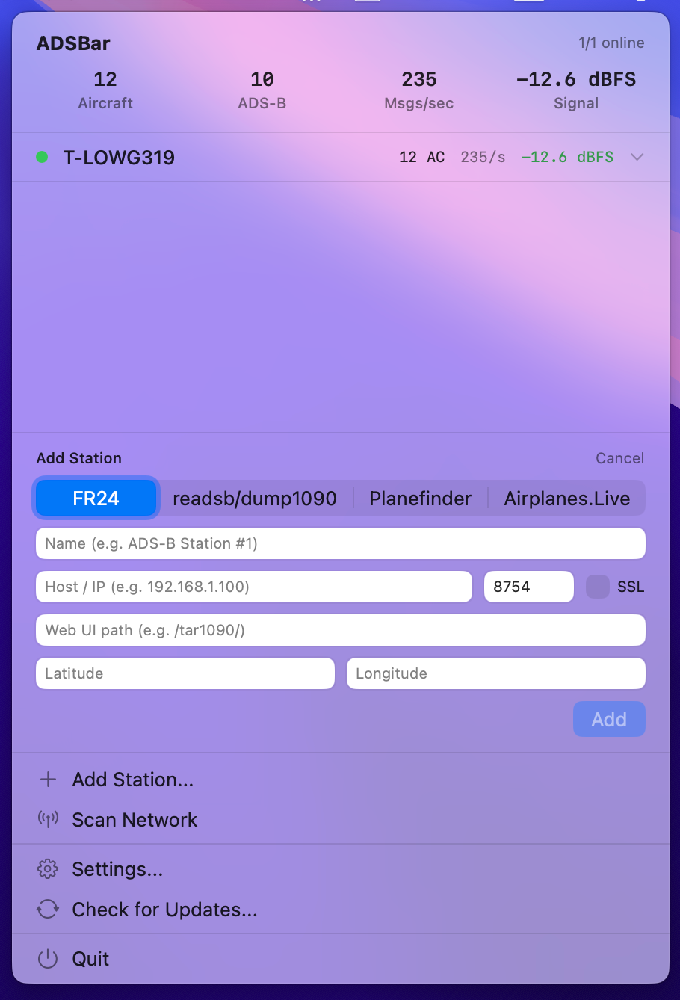
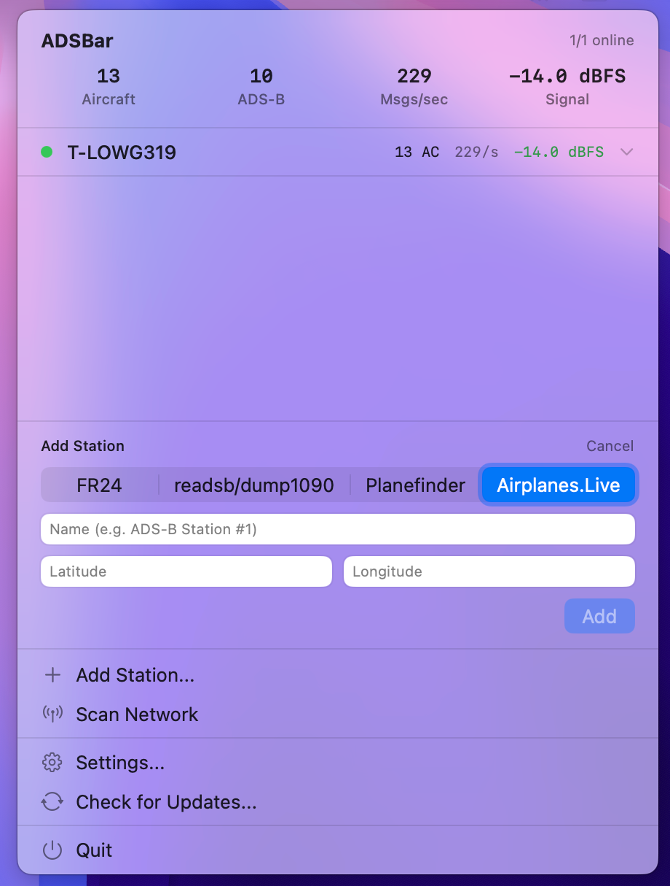
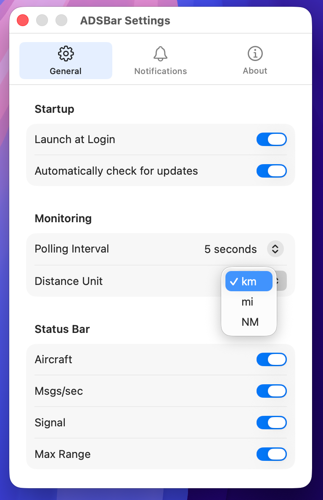

<p align="center">
  
</p>

<h1 align="center">ADSBar</h1>

<p align="center">
A macOS menu bar app for monitoring your ADS-B stations.<br>
Supports FR24, readsb/dump1090, Planefinder, and Airplanes.Live.
</p>

## Screenshots



## Features

- Live aircraft count, messages/sec, and signal strength in the menu bar
- Choose what to display in the menu bar (aircraft, msgs/sec, signal, max range)
- Multi-station support with per-device detail view
- Auto-discovery via local network scan (scans your /24 subnet for all station types)
- Max range calculation via Haversine formula (requires receiver coordinates)
- Signal quality indicators with color-coded thresholds
- Notifications when a station goes offline
- Configurable distance units (km, miles, nautical miles)
- Custom receiver location as fallback for range calculation
- Editable Web UI path per station
- Open station web interface or feed status directly from the menu bar
- Local station types stay on your network; Airplanes.Live connects to their public API

## Supported Station Types

| Type            | Port  | API Endpoint          | Covers                                                 |
| --------------- | ----- | --------------------- | ------------------------------------------------------ |
| FR24            | 8754  | `/monitor.json`       | FlightRadar24 feeders                                  |
| readsb/dump1090 | 8080  | `/data/aircraft.json` | readsb, dump1090-fa, PiAware, ADS-B Exchange, RadarBox |
| Planefinder     | 30053 | `/ajax/stats`         | Planefinder clients                                    |
| Airplanes.Live  | 443   | `/feed-status`        | Airplanes.Live feeders (external API)                  |

FR24 stations also pull data from tar1090 (`/tar1090/data/stats.json` and `/tar1090/data/aircraft.json`) when available, giving you signal stats and max range even on FR24-only setups.

Planefinder stations also fetch aircraft data from `/ajax/aircraft` for aircraft count and max range calculation.

Airplanes.Live connects to the external API at `api.airplanes.live` and shows feed status, MLAT peers, bandwidth, RTT, and nearby aircraft count. No API key required.

## Install

**Homebrew:**

```bash
brew install --cask ciruz/tap/adsbar
```

**Manual:**

1. Download the latest `.zip` from [Releases](https://github.com/ciruz/adsbar/releases)
2. Unzip and move `ADSBar.app` to `/Applications`
3. Open normally, the app is signed and notarized

## Permissions

- **Local Network Access** - required to reach your stations over the LAN. Without this, nothing works.
- **Notifications** (optional) - alerts when a station goes offline.



## Adding Stations

**Network Scan:** Click **Scan Network** in the popover. ADSBar scans your /24 subnet for FR24, readsb, and Planefinder stations automatically. Airplanes.Live must be added manually since it's an external service.

**Manual:** Click **Add Station...** and select the station type, name, IP address, and port. The port auto-fills based on the selected type.





**Custom Location:** If your receiver doesn't expose coordinates via `receiver.json`, you can enter latitude and longitude manually in the add/edit form. This enables max range calculation.

## Settings

Polling interval (5s - 60s), distance unit (km/miles/NM), launch at login, status bar toggles, and notification preferences are in **Settings...** in the popover.



## Menu Bar

The menu bar shows a plane icon with your station stats:

```
✈ 33 | 524/s | -13.0 dBFS
```

Each value can be toggled on or off in Settings. Click to open the popover with per-station details including aircraft count, ADS-B split, messages, signal, noise, max range, feed status, and more.

## Build from Source

Requires macOS 14.0+ and Xcode.

```
git clone https://github.com/ciruz/adsbar.git
cd adsbar
open ADSBar/ADSBar.xcodeproj
```

Sparkle is added via Swift Package Manager and resolves automatically.

## License

MIT
